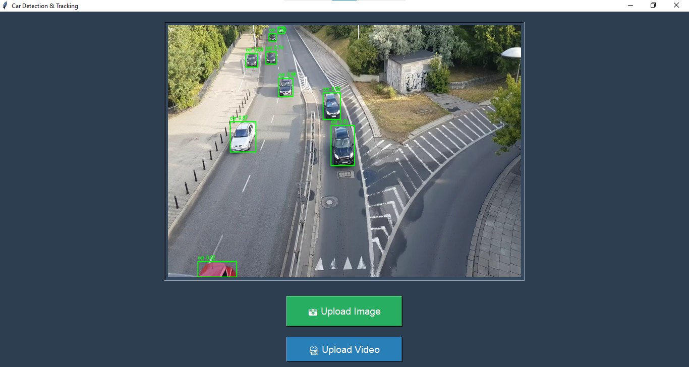

# **Car Object Tracking using YOLOv8m** 🚗🔍  

## **Overview**  
This project utilizes **YOLOv8m** to detect and track vehicles in **images and videos**. It features a **Tkinter-based GUI** for easy file selection and real-time object tracking.  

## **Features**  
✅ **Real-time Object Detection** – Detects and tracks vehicles efficiently  
✅ **High Accuracy** – Uses **YOLOv8m** for precise detection  
✅ **Optimized Performance** – Efficient frame resizing for smooth video processing  
✅ **User-Friendly UI** – Simple interface for uploading and processing files  

## **Installation**  
### **1️⃣ Clone the Repository**  
```sh
git clone https://github.com/Sandeepmopidevi/Car-Object-Tracking-using-YOLOv8m.git
cd Car-Object-Tracking-using-YOLOv8m
```

### **2️⃣ Install Dependencies**  
```sh
pip install ultralytics opencv-python pillow tkinter
```

### **3️⃣ Run the Application**  
```sh
python app.py
```

## **Usage**  
1️⃣ Click **"Upload Image"** to detect vehicles in an image.  
2️⃣ Click **"Upload Video"** to track vehicles in real-time.  
3️⃣ Press **‘Q’** to stop video processing.  

## **Technology Stack**  
🔹 **YOLOv8m** – Advanced object detection model  
🔹 **OpenCV** – Image/Video processing  
🔹 **Tkinter** – GUI for easy interaction  
🔹 **Python** – Core programming language  

## **Applications**  
🚦 **Traffic Monitoring** – Track vehicle movement on roads  
🚗 **Autonomous Vehicles** – Assist in self-driving car research  
📸 **Smart Surveillance** – Identify vehicles in security footage  

## **Demo**  
🖼️ **Image Detection**  
  

## **License**  
📝 MIT License – Free to use and modify.  
